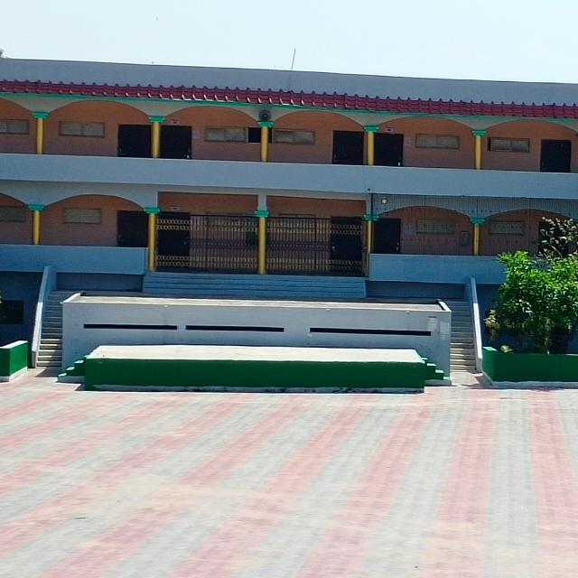

<html>
<head><title>G.B.P.S</title>

</head>
<body bgcolor="black"><table border="1" width="100%" cellpadding="20px"><tr><th>

<a href="home.html">
<button>Home</button>
</a></th><th>
<a href="about.html">
<button>About</button>
</a></th><th>
 <a href="gallery1.html"><button>Gallery</button></a> </th><th>
<a href="a.html"> <button>Academics</button></a> </th><th>
<a href="facilities.html">
<button>Facilities</button></a></th><th>
<a href="teacher records.html">
<button>Teacher records</button></a></th><th>
<a href="contact us.html">
<button>Contact us</button></a> </th><th>
<a href="website developer.html">
<button>Website Developer</button></a></th></tr></table>
	<h1 align="center"> 		 		Gyan Bharti Public School		 	</h1> 	

</body>
</html>
